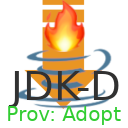

# JDKDownloader  
⚠ The project is in an experimental stage and not stable ⚠

Downloads jdks/jres

### Why don't just download Java via the API of the provider directly?
This is technially possible and also a very good solution.

However there are some problems:
1. Automatically resolving OS and Architecture is not that easily possible on different operating systems. 
This would require a lot of ``if`` statements and is also dependent on the platform (Windows → ``batch or powershell`` | Linux → ``shell``)
2. Configuration may differ a lot between providers
3. You get a compressed file (usually ``zip`` or ``tar.gz``), that has to be extracted (you need some kind of compression tool).
Sometimes (e.g. when using AdoptOpenJDK) you also have the problem that the comporessed file doesn't include the jdk directly, because there is a folder:

### Providers
Note: These are just download providers.

#### AdoptOpenJDK
WIP 🔧

### Nuget
| Module | Nuget |
| --- | --- |
|  Base |  |
|  Provider.AdoptOpenJDK |  |

### Development 
| Workflow | Status |
| --- | --- |
| Sonar Build |     |
| Check Build |  |
| Build Nuget |  |
| Release |    |

